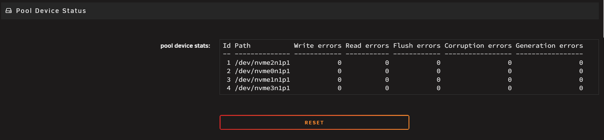
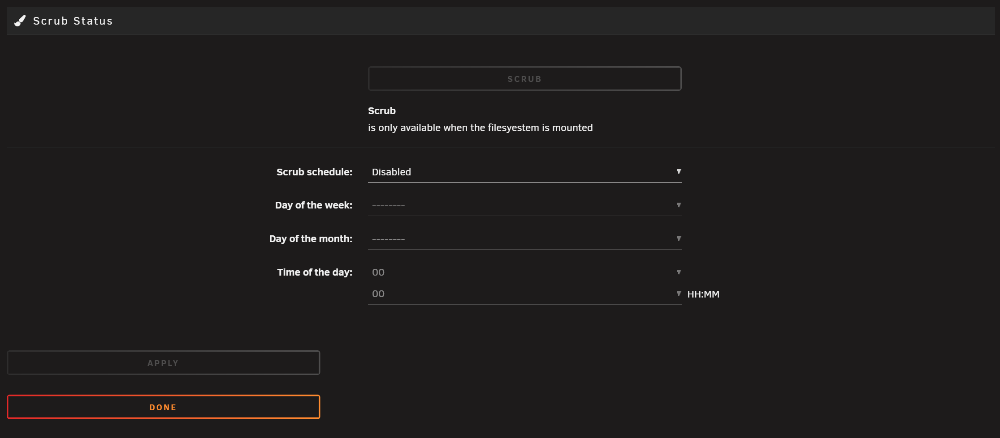

# Responsive WebGUI Plugin Migration Guide

## Why Responsive? The Benefits for Unraid Users & Developers

Unraid's webGUI has moved to a fully responsive design system. This isn't just a facelift—it's a fundamental shift in how plugins and core pages are built and rendered. Here's why this matters:

- **Mobile & Tablet Friendly:** Manage your server from any device, any screen size, no more pinching/zooming.
- **Consistent Layouts:** No more broken forms or tables on small screens. Everything adapts.
- **Modern Look & Feel:** Cleaner, more professional UI that matches user expectations.
- **Future-Proof:** New features and plugins can be built once, work everywhere.
- **Accessibility:** Improved support for screen readers and keyboard navigation.

**Bottom line:** Users get a better experience, and plugin devs spend less time fighting CSS and more time building features.

---

## Prerequisite: How .page Files Are Parsed (Markdown, Whitespace, and Structure)

Unraid's plugin system uses `.page` files, which are parsed using a custom Markdown engine. Understanding this is key to writing responsive plugins.

### The Parsing Pipeline
1. **Header Parsing:** The top of the file (before `---`) is parsed as INI for metadata (Title, Menu, etc).
2. **Content Parsing:** The rest is parsed as Markdown, with special handling for translation (`_(text)_`) and definition lists.
3. **PHP Evaluation:** Any PHP code is executed after Markdown is processed.

### Whitespace & Markdown Structure
- **Definition List Syntax:**
  ```markdown
  _(Label)_:
  : <input ...>
  ```
  This is parsed into:
  ```html
  <dl>
    <dt>Label</dt>
    <dd><input ...></dd>
  </dl>
  ```
- **Whitespace is Critical:**
  - The colon (`:`) must be at the start of the line, followed by a space.
  - Indentation or extra spaces can break parsing, causing elements to fall outside the `<dl>` structure.
- **Final Render:**
  - The browser receives a series of `<dl>`, `<dt>`, and `<dd>` elements, which are then styled by CSS.
  - Responsive CSS expects this structure to apply correct flex/grid layouts.

### Block Tags and Markdown Parsing

By default, if you use a `<div>` (or any block-level HTML tag) in your `.page` file, **the contents inside that tag will NOT be parsed as markdown**. The markdown parser treats the contents as raw HTML and leaves them untouched.

**If you want the contents of a `<div>` (or other block tag) to be parsed as markdown, you must add `markdown="1"` to the tag:**

```html
<div>
  _(This will NOT be parsed as markdown)_
  : <input type="text">
</div>
```

**With `markdown="1"`:**
```html
<div markdown="1">
  _(This WILL be parsed as markdown inside the div)_
  : <input type="text">
</div>
```
Example 2
**With `markdown="1"`:**
```html

_(This WILL be parsed as markdown)_
: <div markdown="1">
    _(This WILL be parsed as markdown inside the div)_
    <input type="text">
</div>
```

This applies to all block-level tags (div, section, article, etc). Use `markdown="1"` if you need markdown parsing inside a custom container.

### Why This Matters
If your markup doesn't follow the expected pattern, the CSS can't do its job. That's when you get broken layouts, giant buttons, or misaligned fields.

---

## Common Bugs in Non-Responsive .page Files (and How to Fix Them)

### 1. Large Buttons
**Bug:** Buttons stretch full width, look massive, or break the layout.


*Pool Device Status page before fix: The Reset button is stretched and not visually grouped.*

**Why:**
- On desktop screens, `<dd>` uses `display: flex; flex-direction: column;` (see the responsive CSS). This means every direct child of `<dd>`—including buttons, inputs, spans, etc.—is stacked vertically and stretched to the available width by default.
- If you put a button directly inside `<dd>`, it becomes a flex item and will stretch to fill the column (unless it's inside a `<span>` or similar inline container).
- Old markup: `_(Action)_:
: <input type="button" value="Click Me">`

**Fix:**
- Wrap buttons in a `<span>` (or `<span class="buttons-spaced">` for groups):
  ```markdown
  _(Action)_:
  : <span><input type="button" value="Click Me"></span>
  ```
- For button groups:
  ```markdown
  &nbsp;
  : <span class="buttons-spaced">
      <input type="submit" value="Apply">
      <input type="button" value="Done">
    </span>
  ```

### 2. [Settings Label + Inputs Are Offset (Whitespace/Parsing Issue)]
**Bug:** Labels and inputs don't line up, or inputs appear on a new line, not next to their label.


*Scrub Status page before fix: Labels and controls are misaligned due to whitespace/structure issues.*

**Why:**
- Extra spaces, tabs, or missing colons in the Markdown definition list syntax.
- Elements placed outside the `label: content` pattern aren't wrapped in `<dl>`, `<dt>`, `<dd>`.

**Fix:**
- Make sure every input is inside a definition list:
  ```markdown
  _(Setting Name)_:
  : <input type="text" ...>
  ```
- For elements with no label, use `&nbsp;` as the label:
  ```markdown
  &nbsp;
  : <span class="buttons-spaced">...</span>
  ```
- Remove rogue elements outside the definition structure.

---

## Making Wide Tables Responsive: Using the TableContainer Class

When you have tables with **a lot of columns** (wide tables) in your plugin, you should wrap them in a special container to ensure they remain usable on all screen sizes. The `TableContainer` class sets a **minimum width** on the table, so it doesn't shrink too small on mobile or narrow windows. This allows users to scroll horizontally to view the entire table, especially when there are many columns.

### How to Use
- For tables with many columns (wide tables), wrap them in a `<div class="TableContainer">`.
- For simple/narrow tables, this wrapper is usually not needed.

### Why?
- Without this wrapper, wide tables may become too small to read or interact with at smaller screen sizes.
- The TableContainer class sets a `min-width` on the table and enables horizontal scrolling, so users can always access all columns, even on mobile.

### Example: Before
```html
<table>
  <thead>
    <tr><th>Col1</th><th>Col2</th><th>Col3</th>...<th>ColN</th></tr>
  </thead>
  <tbody>
    <tr><td>...</td><td>...</td><td>...</td>...<td>...</td></tr>
  </tbody>
</table>
```

### Example: After
```html
<div class="TableContainer">
  <table>
    <thead>
      <tr><th>Col1</th><th>Col2</th><th>Col3</th>...<th>ColN</th></tr>
    </thead>
    <tbody>
      <tr><td>...</td><td>...</td><td>...</td>...<td>...</td></tr>
    </tbody>
  </table>
</div>
```

**Tip:** Only wrap the immediate table element—don't nest TableContainers or wrap unrelated content.

---

## Real-World Example: DeviceInfo.page

**Before:**
```markdown
<input type="submit" value="Apply">
<input type="button" value="Done">
```
- Buttons are outside the definition list, so they break the layout and look wrong on mobile.

**After:**
```markdown
&nbsp;
: <span class="buttons-spaced">
    <input type="submit" value="Apply">
    <input type="button" value="Done">
  </span>
```
- Now the buttons are inside the `<dl>`, `<dt>`, `<dd>` structure, and the CSS can lay them out responsively.

**Screenshot Reference:**
- See attached images for examples of large buttons and offset fields before/after fixing the markup.

---

## Summary
- Always use the definition list pattern for settings and controls.
- Wrap button groups in `<span class="buttons-spaced">`.
- Watch your whitespace and colons—Markdown parsing is strict.
- Test on mobile and desktop to catch layout issues early.

---

## Quick Fix: Opting Out of Responsive Layout (If You're Short on Time)

If you can't dedicate time right now to fully update your plugin for the new responsive system, you can temporarily opt out of the responsive CSS for your page. This will preserve the legacy layout and prevent your page from breaking, but **it is not a long-term solution**.

### How to Opt Out
Add the following to the top (YAML header) of your `.page` file:

```yaml
ResponsiveLayout="false"
```

**Example:**
```yaml
Title="Add VM"
Tag="clipboard"
Cond="(pgrep('libvirtd')!==false)"
Markdown="false"
ResponsiveLayout="false"
---
```

See `AddVM.page` and `UpdateVM.page` for real-world examples of this approach.

### What This Does
- Wraps your page content in a `<div>` that forces a **minimum width of 1200px** via CSS. This keeps your layout looking like the old (non-responsive) UI, even on smaller screens.
- Your page will not adapt to mobile or small window sizes—it will always be at least 1200px wide, and users may need to scroll horizontally on small devices.
- **This is a stopgap.** You should still plan to migrate to the responsive system for the best user experience and future compatibility.
